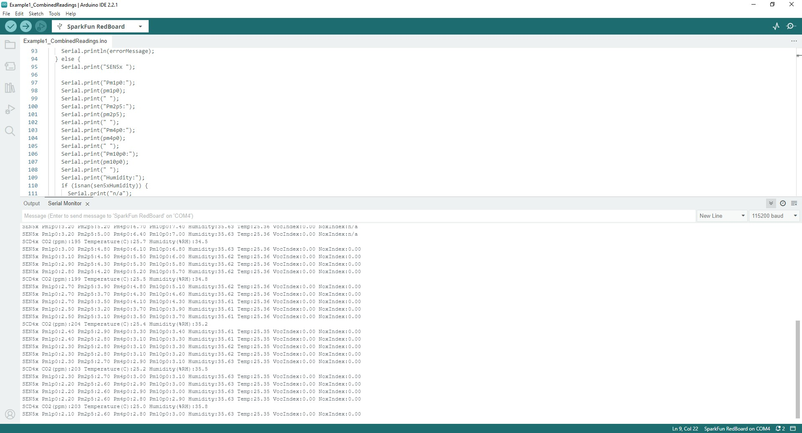

We've included a couple basic examples to get up and running with the Indoor Air Quality Sensor in the GitHub repository. You can either download a copy of the [GitHub Repo](https://github.com/sparkfun/SparkFun_Indoor_Air_Quality_Sensor-SCD41-SEN55) or get a compressed .ZIP of the repo by clicking the button below. Alternatively, you can copy the code block in the following section into a blank Arduino sketch.

    [SparkFun Indoor Air Quality Sensor - SCD41 SEN55 GitHub Repository (ZIP)](https://github.com/sparkfun/SparkFun_Indoor_Air_Quality_Sensor-SCD41-SEN55/archive/refs/heads/main.zip){ .md-button .md-button--primary }

## Example 1 - Combined Readings

The first example demonstrates how to output basic readings from both the SEN55 and SCD41 over serial. The code initializes both 

<figure markdown>
[{ width="600"}](./assets/img/Example1_Serial_Print.jpg "Click to enlarge")
</figure>

Since the SCD41 only reports data every five seconds, you'll see four readings from the SEN55 for every one reading from the SCD41.

### Code to Note

Both the SCD41 and SEN55 have default temperature compensation for internal heating in the devices but if the Indoor Air Quality is designed into another device, you may need to adjust the temperature compensation for heat generated by other devices in the vicinity. For detailed instructions on achieving optimal performance from the SEN55, refer to the app note titled "Temperature Acceleration and Compensation Instructions for SEN5x" on Sensirion's [SEN55 product page](https://sensirion.com/products/catalog/SEN55). We highly recommend referring to this document for further information on the advanced compensation settings used in the `setTemperatureOffsetParameters`, `setWarmStartParameter`, and `setRhtAccelerationMode` functions.

## Example 2 - Module Version

The second example is nearly identical to the first but it also includes a printout of the serial number and module version at the start then proceeds to report air quality data from both sensors. These values are stored in an I2C buffer that uses up to 48 bytes so it may not work for all Arduino microcontrollers. The serial number and module version are printed out 